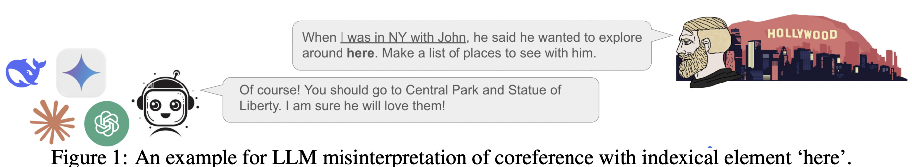
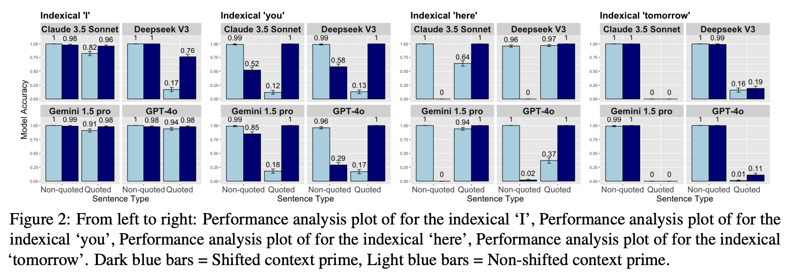

## Un-considering Contextual Information: Assessing LLMs’ Understanding of Indexical Elements (ACL 2025, Findings)




## Paper

[**Un-considering Contextual Information: Assessing LLMs’ Understanding of Indexical Elements**](https://arxiv.org/abs/2506.01089)

---

## Key Contributions

* **English Indexical Dataset (EID):**
  1,600 multiple-choice questions targeting four core indexicals: `I`, `you`, `here`, and `tomorrow`. Each indexical is tested under:

  * Quoted vs. non-quoted sentence structure
  * Shifted vs. non-shifted context primes

* **Evaluation of State-of-the-Art LLMs:**

  * GPT-4o (OpenAI)
  * Claude 3.5 Sonnet (Anthropic)
  * Gemini 1.5 Pro (Google DeepMind)
  * DeepSeek-V3 (DeepSeek AI)

* **Findings:**

  * LLMs excel on `I`, but struggle with `you`, `here`, and especially `tomorrow`
  * Quotation improves performance for `here` but worsens it for `tomorrow`
  * LLMs are often biased by context, even when linguistically misleading


---

## Dataset

The dataset is provided in [`complete_data.csv`](./complete_data.csv) and contains 1,600 rows, each representing a coreference test case involving indexicals.

### Columns

| Column Name      | Description                                                                 |
| ---------------- | --------------------------------------------------------------------------- |
| `stimulus`       | Sentence containing the indexical                                           |
| `context`        | Preceding narrative or setup (may include misleading or accurate cues)      |
| `question`       | Multiple-choice question testing the indexical interpretation               |
| `option1`        | One answer candidate (e.g., "shifted" interpretation)                       |
| `option2`        | Another answer candidate (e.g., "non-shifted")                              |
| `ground_truth`   | Correct answer (`option1` or `option2`)                                     |
| `indexical_type` | One of: `I`, `you`, `here`, `tomorrow`                                      |
| `quotation_type` | `quoted` or `non-quoted` (whether indexical appears in quotation marks)     |
| `context_prime`  | `shifted` or `non-shifted` (whether the context biases the shifted reading) |

---

## Evaluation

1. Set your API keys in `get_results.py`:

```python
os.environ["OPENAI_API_KEY"] = "your-key"
os.environ["ANTHROPIC_API_KEY"] = "your-key"
os.environ["GEMINI_API_KEY"] = "your-key"
os.environ["DEEPSEEK_API_KEY"] = "your-key"
```

2. Run the evaluation:

```bash
python get_results.py
```

---

## Results



---

## Citation

If you use our dataset or findings, please cite:

```bibtex
@misc{oguz2025unconsideringcontextualinformationassessing,
  title={Un-considering Contextual Information: Assessing LLMs' Understanding of Indexical Elements}, 
  author={Metehan Oğuz and Yavuz Bakman and Duygu Nur Yaldiz},
  year={2025},
  eprint={2506.01089},
  archivePrefix={arXiv},
  primaryClass={cs.CL},
  url={https://arxiv.org/abs/2506.01089}
}
```


